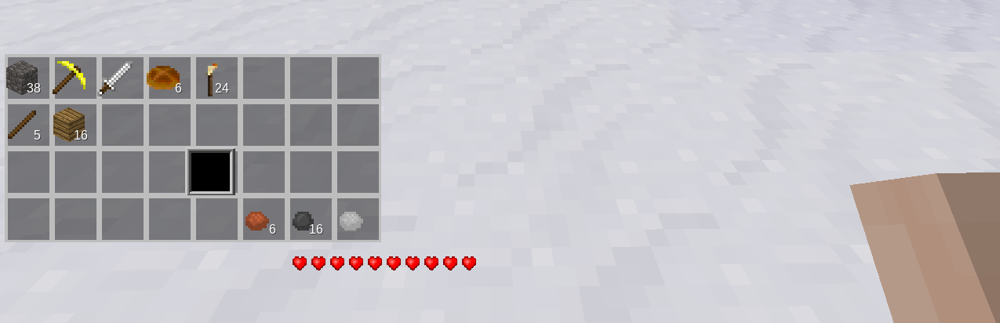
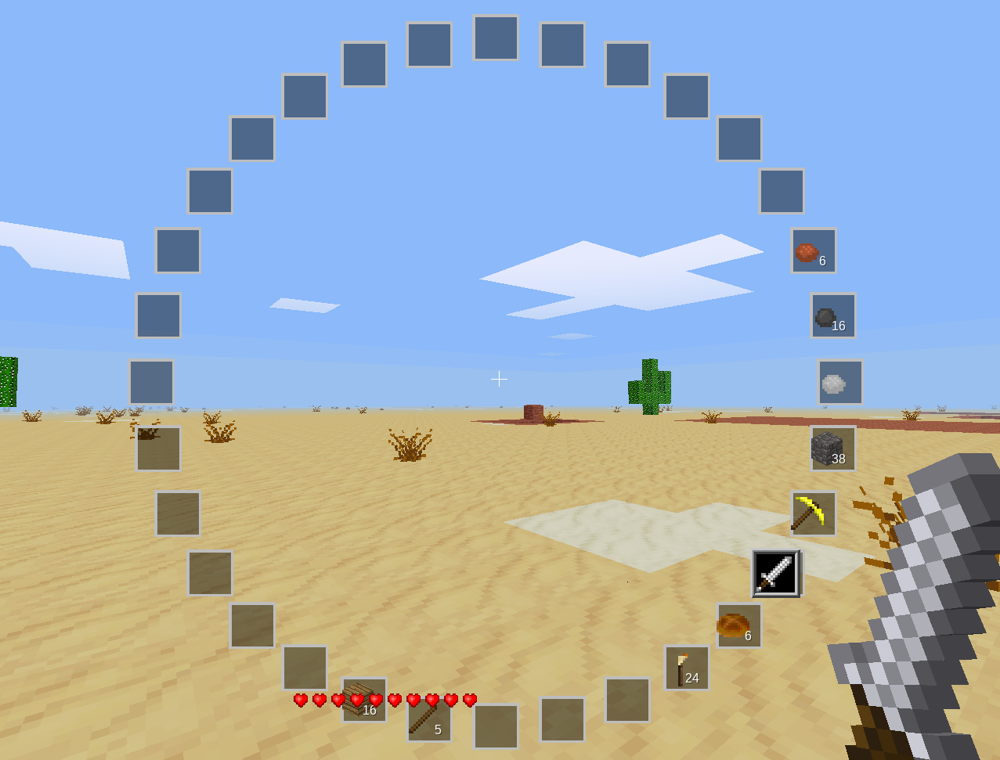

## Oddbar ##

_I don't know what I'm doing._  

It makes your hotbar weird.  
  
`/odb` is your best friend.  
  
  
  
  
#### What next? ####
No clue.  
Todo:  
* Fix bugs
* Make more usable
* Fix more bugs
* ???
* Profit
  
#### Attribution/License ####
Everything under MIT unless otherwise specified.  
See `LICENSE.txt`.  
  
paramat (CC BY-SA 3.0): oddbar_slot.png (original: gui_hotbar.png)  
  
#### Disclaimer ####
Don't use this
